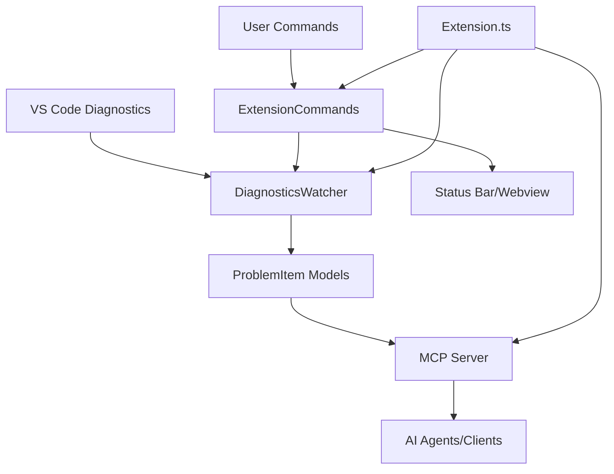

# Source Code Architecture

This directory contains the complete source code for the MCP Diagnostics Extension, organized following **Clean Architecture** principles to ensure maintainability, testability, and separation of concerns.

## 🏗️ Architecture Overview

```
src/
├── extension.ts           # 🚀 Main entry point - Extension activation/deactivation
├── commands/             # 🎮 VS Code commands and UI interactions
├── core/                 # 🧠 Business logic (framework-independent)
├── infrastructure/       # 🔌 External system adapters (VS Code API, MCP)
├── shared/              # 🔗 Common types, constants, and utilities
└── test/                # 🧪 Comprehensive test suite
```

## 📋 Component Responsibilities

### 🚀 Extension Entry Point
- **`extension.ts`** - Main activation logic, dependency injection, lifecycle management

### 🎮 Commands Layer
- **User Interface** - VS Code commands, status bar, webviews
- **User Interactions** - Command handlers, UI state management

### 🧠 Core Business Logic
- **Framework Independent** - Pure TypeScript, no VS Code dependencies
- **Domain Models** - ProblemItem, diagnostic data structures
- **Business Services** - DiagnosticsWatcher, core processing logic

### 🔌 Infrastructure Layer
- **VS Code Adapter** - Wraps VS Code APIs for testability
- **MCP Server** - Model Context Protocol server implementation
- **External Integrations** - Third-party service adapters

### 🔗 Shared Components
- **Types** - Common interfaces and type definitions
- **Constants** - Configuration values and enums
- **Utilities** - Helper functions and common logic

### 🧪 Testing Infrastructure
- **Unit Tests** - Component isolation testing
- **Integration Tests** - Component interaction testing
- **Test Fixtures** - Mock data and test utilities

## 🔄 Data Flow Architecture



## 🎯 Design Principles

### Clean Architecture
- **Dependency Inversion** - Core logic doesn't depend on frameworks
- **Single Responsibility** - Each component has one clear purpose
- **Interface Segregation** - Small, focused interfaces

### Performance First
- **Debounced Events** - 300ms debouncing for diagnostic changes
- **Efficient Caching** - Map-based URI caching for O(1) lookups
- **Memory Management** - Proper disposal and cleanup

### Type Safety
- **Strict TypeScript** - All strict compiler options enabled
- **Runtime Validation** - Zod schemas for external data
- **Comprehensive Types** - Full type coverage throughout

## 🚀 Getting Started

### Development Setup
```bash
# Install dependencies
npm install

# Run tests
npm test

# Start development
npm run watch
```

### Key Entry Points
1. **`extension.ts`** - Start here to understand activation flow
2. **`core/diagnostics/`** - Core business logic
3. **`infrastructure/mcp/`** - MCP server implementation
4. **`commands/`** - User interface components

## 📚 Directory Deep Dive

Each subdirectory contains its own README with detailed information:

- 📁 **[commands/](./commands/README.md)** - VS Code commands and UI components
- 📁 **[core/](./core/README.md)** - Framework-independent business logic
- 📁 **[infrastructure/](./infrastructure/README.md)** - External system adapters
- 📁 **[shared/](./shared/README.md)** - Common types and utilities
- 📁 **[test/](./test/README.md)** - Testing infrastructure and strategies

## 🔧 Development Guidelines

### Adding New Features
1. Start with **core/** for business logic
2. Add **infrastructure/** adapters if needed
3. Create **commands/** for user interactions
4. Update **shared/** types as necessary
5. Write tests in **test/** following TDD

### Code Organization Rules
- Core logic must not import from infrastructure
- Infrastructure can import from core and shared
- Commands can import from all layers
- Shared can only import from external libraries

## 📊 Quality Metrics

- **Test Coverage**: >96% statement coverage
- **Type Safety**: 100% TypeScript strict mode
- **Performance**: <500ms diagnostic processing
- **Memory**: <100MB in large workspaces

---

*This architecture ensures the extension is maintainable, testable, and performant while providing a clear separation of concerns for easy development and debugging.*
