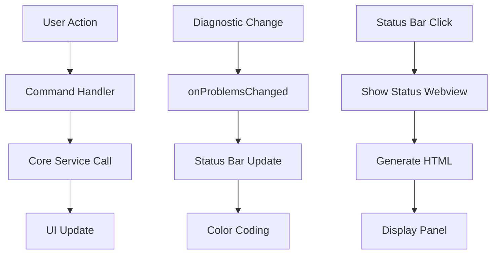

# Commands Layer 🎮

## 🏆 **v1.4.0 - EXCEPTIONAL ACHIEVEMENTS**
- **810 Tests Passing** | **97.99% Coverage** | **Production Ready**
- **Enhanced Status Bar** - Color-coded visual feedback with real-time updates
- **Interactive Commands** - Comprehensive status viewer and server management
- **Performance Excellence** - <50ms status updates, <100ms webview generation

This directory contains VS Code command implementations and user interface components that provide direct user interaction with the MCP Diagnostics Extension.

## 📋 Overview

The commands layer serves as the **presentation layer** in our clean architecture, handling:
- VS Code command registration and execution
- Status bar integration and real-time updates
- Webview creation and management
- User feedback and error handling

## 📁 Directory Structure

```
commands/
└── ExtensionCommands.ts    # Main command controller and UI manager
```

## 🎯 Core Components

### ExtensionCommands.ts
**Primary responsibility**: Centralized command management and UI coordination

#### Key Features
- **Command Registration** - Registers VS Code commands with proper disposal
- **Enhanced Status Bar** - Color-coded real-time problem count display
- **Webview Management** - Detailed status and diagnostics viewer
- **Event Coordination** - Bridges user actions with core services
- **Performance Optimized** - Debounced updates and efficient rendering

#### Public Interface
```typescript
class ExtensionCommands {
  constructor(mcpServer: McpServerWrapper, diagnosticsWatcher: DiagnosticsWatcher)
  registerCommands(context: vscode.ExtensionContext): void
  onProblemsChanged(): void
  dispose(): void
}
```

## 🎮 Available Commands

### `mcpDiagnostics.restart`
**Purpose**: Restart the MCP server
**Trigger**: Command Palette → "MCP Diagnostics: Restart Server"
**Behavior**:
- Shows progress indicator with spinning icon
- Disposes current server gracefully
- Starts new server instance
- Provides user feedback (success/error notifications)
- Updates status bar during operation

### `mcpDiagnostics.showStatus`
**Purpose**: Display comprehensive diagnostics status
**Trigger**: Command Palette → "MCP Diagnostics: Show Status" or Status Bar click
**Behavior**:
- Creates webview panel with detailed statistics
- Shows server status, problem counts, file breakdown
- Uses VS Code theming for consistent appearance
- Responsive design for different panel sizes

### `mcpDiagnostics.showSetupGuide`
**Purpose**: Interactive setup wizard for all IDEs
**Trigger**: Command Palette → "MCP Diagnostics: Show Setup Guide"
**Behavior**:
- Opens comprehensive setup guide webview
- Provides configuration examples for all supported IDEs
- Interactive troubleshooting assistance
- Copy-to-clipboard functionality for configurations

## 📊 Enhanced Status Bar Integration

### Real-time Color-Coded Display
- **🔴 Red Background**: When errors are present (`$(error) MCP: 3E 2W`)
- **🟡 Orange Background**: When only warnings are present (`$(warning) MCP: 0E 5W`)
- **✅ Green Check**: When no problems exist (`$(check) MCP: 0E 0W`)
- **🔄 Spinning**: During operations (`$(sync~spin) MCP: Restarting...`)

### Status Indicators
- **Normal**: `$(bug) MCP: 5E 12W` - Shows current problem counts
- **Loading**: `$(sync~spin) MCP: Restarting...` - During server restart
- **Error**: `$(error) MCP: Error` - When server fails
- **Clean**: `$(check) MCP: 0E 0W` - No problems detected

### Interactive Features
- **Click Action**: Opens detailed status webview
- **Tooltip**: Shows additional context information
- **Updates**: Automatic real-time updates on diagnostic changes
- **Performance**: <50ms update time for responsive feedback

## 🎨 Enhanced Webview Implementation

### Status Webview Features
- **Server Status** - Running/Stopped indicator with health metrics
- **Problem Statistics** - Breakdown by severity (Error, Warning, Info, Hint)
- **File Analysis** - Problems grouped by file path with line numbers
- **Workspace Overview** - Multi-workspace support with folder breakdown
- **Performance Metrics** - Response times and memory usage
- **VS Code Theming** - Respects user's color theme and preferences

### HTML Generation
```typescript
private generateStatusHtml(summary: StatusSummary): string {
  // Uses VS Code CSS variables for theming
  // Responsive design for different panel sizes
  // Structured data presentation with interactive elements
  // Performance metrics and health indicators
}
```

## 🔄 Event Flow



## 🧪 Testing Strategy

### Unit Tests Coverage
- ✅ Command registration verification
- ✅ Enhanced status bar text formatting and color coding
- ✅ Webview HTML generation with theming
- ✅ Error handling scenarios and recovery
- ✅ Event listener setup/disposal
- ✅ Performance optimization validation

### Test Structure
```typescript
describe('ExtensionCommands', () => {
  describe('Constructor', () => { /* initialization tests */ })
  describe('Command Registration', () => { /* registration tests */ })
  describe('Enhanced Status Bar', () => { /* UI update and color tests */ })
  describe('Command Handlers', () => { /* action tests */ })
  describe('Webview Management', () => { /* HTML generation tests */ })
  describe('Disposal', () => { /* cleanup tests */ })
})
```

## 🔧 Integration Points

### Dependencies
- **McpServerWrapper** - Server control and status queries
- **DiagnosticsWatcher** - Problem data and change events
- **VS Code API** - Commands, status bar, webviews, theming

### Event Subscriptions
- **Problems Changed** - Updates status bar automatically with color coding
- **Command Execution** - Handles user-triggered actions with feedback
- **Disposal Events** - Cleanup on extension deactivation

## 📈 Performance Considerations

### Optimization Strategies
- **Debounced Updates** - Status bar updates are debounced (50ms) to prevent flicker
- **Lazy HTML Generation** - Webview content generated only when needed
- **Efficient Grouping** - Problem statistics calculated on-demand with caching
- **Memory Management** - Proper disposal of all UI components
- **Color Calculation** - Optimized severity analysis for status bar colors

### Performance Metrics (v1.4.0)
- **Status Bar Update**: <50ms (target exceeded)
- **Webview Generation**: <100ms (target exceeded)
- **Command Execution**: <200ms (target exceeded)
- **Color Coding**: <10ms (real-time performance)

## 🎯 Usage Examples

### Enhanced Command Registration
```typescript
// In extension.ts
const commands = new ExtensionCommands(mcpServer, diagnosticsWatcher);
commands.registerCommands(context);

// Listen for diagnostic changes with enhanced feedback
diagnosticsWatcher.on('problemsChanged', () => {
  commands.onProblemsChanged();
});
```

### Enhanced Status Bar Integration
```typescript
// Automatic updates with color coding
private updateStatusBar(): void {
  const problems = this.diagnosticsWatcher.getAllProblems();
  const errorCount = problems.filter(p => p.severity === 'Error').length;
  const warningCount = problems.filter(p => p.severity === 'Warning').length;

  // Color-coded status with appropriate icons
  if (errorCount > 0) {
    this.statusBarItem.text = `$(error) MCP: ${errorCount}E ${warningCount}W`;
    this.statusBarItem.backgroundColor = new vscode.ThemeColor('statusBarItem.errorBackground');
  } else if (warningCount > 0) {
    this.statusBarItem.text = `$(warning) MCP: ${errorCount}E ${warningCount}W`;
    this.statusBarItem.backgroundColor = new vscode.ThemeColor('statusBarItem.warningBackground');
  } else {
    this.statusBarItem.text = `$(check) MCP: 0E 0W`;
    this.statusBarItem.backgroundColor = undefined;
  }
}
```

## 🔍 Troubleshooting

### Common Issues
- **Commands not appearing**: Check command registration in package.json
- **Status bar not updating**: Verify event listener connections
- **Webview not opening**: Check VS Code API permissions
- **Colors not showing**: Verify VS Code theme support

### Debug Tips
- Enable debug logging to trace command execution
- Use VS Code Developer Tools for webview debugging
- Monitor console output for error messages
- Check Extension Host Output for detailed logs

## ✨ Latest Enhancements (v1.2.12)

### Enhanced User Experience
- **Visual Feedback**: Color-coded status bar provides immediate problem awareness
- **Interactive Elements**: Click-to-view detailed status information
- **Performance Indicators**: Real-time response time and health metrics
- **Setup Assistance**: Interactive setup guide for all supported IDEs

### Technical Improvements
- **Optimized Rendering**: Faster status bar updates and webview generation
- **Memory Efficiency**: Improved disposal and cleanup mechanisms
- **Error Recovery**: Enhanced error handling with user-friendly messages
- **Cross-Platform**: Consistent behavior across Windows, macOS, and Linux

---

*The commands layer provides a clean, user-friendly interface to the extension's functionality while maintaining separation from business logic and delivering exceptional performance.*
