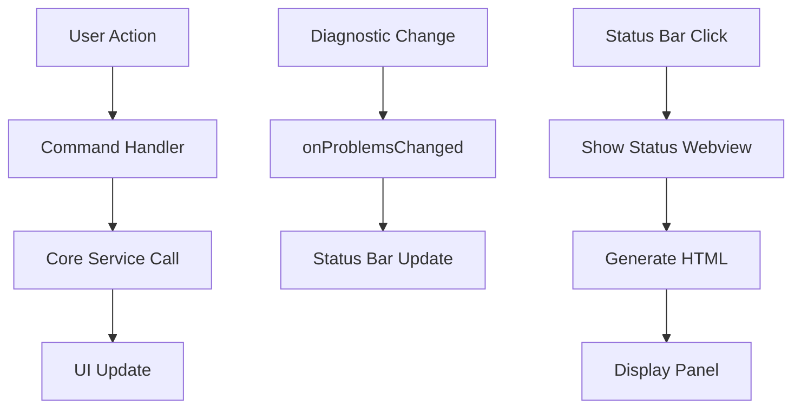

# Commands Layer 🎮

This directory contains VS Code command implementations and user interface components that provide direct user interaction with the MCP Diagnostics Extension.

## 📋 Overview

The commands layer serves as the **presentation layer** in our clean architecture, handling:
- VS Code command registration and execution
- Status bar integration and real-time updates
- Webview creation and management
- User feedback and error handling

## 📁 Directory Structure

```
commands/
└── ExtensionCommands.ts    # Main command controller and UI manager
```

## 🎯 Core Components

### ExtensionCommands.ts
**Primary responsibility**: Centralized command management and UI coordination

#### Key Features
- **Command Registration** - Registers VS Code commands with proper disposal
- **Status Bar Integration** - Real-time problem count display
- **Webview Management** - Detailed status and diagnostics viewer
- **Event Coordination** - Bridges user actions with core services

#### Public Interface
```typescript
class ExtensionCommands {
  constructor(mcpServer: McpServerWrapper, diagnosticsWatcher: DiagnosticsWatcher)
  registerCommands(context: vscode.ExtensionContext): void
  onProblemsChanged(): void
  dispose(): void
}
```

## 🎮 Available Commands

### `mcpDiagnostics.restart`
**Purpose**: Restart the MCP server
**Trigger**: Command Palette → "MCP Diagnostics: Restart Server"
**Behavior**:
- Shows progress indicator
- Disposes current server
- Starts new server instance
- Provides user feedback (success/error)

### `mcpDiagnostics.showStatus`
**Purpose**: Display comprehensive diagnostics status
**Trigger**: Command Palette → "MCP Diagnostics: Show Status" or Status Bar click
**Behavior**:
- Creates webview panel with detailed statistics
- Shows server status, problem counts, file breakdown
- Uses VS Code theming for consistent appearance

## 📊 Status Bar Integration

### Real-time Display
- **Format**: `$(bug) MCP: XE YW` (X errors, Y warnings)
- **Position**: Right side of status bar
- **Click Action**: Opens status webview
- **Updates**: Automatic on diagnostic changes

### Status Indicators
- **Normal**: `$(bug) MCP: 5E 12W` - Shows current problem counts
- **Loading**: `$(sync~spin) MCP: Restarting...` - During server restart
- **Error**: `$(error) MCP: Error` - When server fails

## 🎨 Webview Implementation

### Status Webview Features
- **Server Status** - Running/Stopped indicator
- **Problem Statistics** - Breakdown by severity (Error, Warning, Info, Hint)
- **File Analysis** - Problems grouped by file path
- **Workspace Overview** - Multi-workspace support
- **VS Code Theming** - Respects user's color theme

### HTML Generation
```typescript
private generateStatusHtml(summary: StatusSummary): string {
  // Uses VS Code CSS variables for theming
  // Responsive design for different panel sizes
  // Structured data presentation
}
```

## 🔄 Event Flow



## 🧪 Testing Strategy

### Unit Tests Coverage
- ✅ Command registration verification
- ✅ Status bar text formatting
- ✅ Webview HTML generation
- ✅ Error handling scenarios
- ✅ Event listener setup/disposal

### Test Structure
```typescript
describe('ExtensionCommands', () => {
  describe('Constructor', () => { /* initialization tests */ })
  describe('Command Registration', () => { /* registration tests */ })
  describe('Status Bar', () => { /* UI update tests */ })
  describe('Command Handlers', () => { /* action tests */ })
  describe('Disposal', () => { /* cleanup tests */ })
})
```

## 🔧 Integration Points

### Dependencies
- **McpServerWrapper** - Server control and status queries
- **DiagnosticsWatcher** - Problem data and change events
- **VS Code API** - Commands, status bar, webviews

### Event Subscriptions
- **Problems Changed** - Updates status bar automatically
- **Command Execution** - Handles user-triggered actions
- **Disposal Events** - Cleanup on extension deactivation

## 📈 Performance Considerations

### Optimization Strategies
- **Debounced Updates** - Status bar updates are debounced to prevent flicker
- **Lazy HTML Generation** - Webview content generated only when needed
- **Efficient Grouping** - Problem statistics calculated on-demand
- **Memory Management** - Proper disposal of all UI components

### Performance Metrics
- **Status Bar Update**: <50ms
- **Webview Generation**: <100ms
- **Command Execution**: <200ms

## 🎯 Usage Examples

### Basic Command Registration
```typescript
// In extension.ts
const commands = new ExtensionCommands(mcpServer, diagnosticsWatcher);
commands.registerCommands(context);

// Listen for diagnostic changes
diagnosticsWatcher.on('problemsChanged', () => {
  commands.onProblemsChanged();
});
```

### Status Bar Integration
```typescript
// Automatic updates on diagnostic changes
private updateStatusBar(): void {
  const problems = this.diagnosticsWatcher.getAllProblems();
  const errorCount = problems.filter(p => p.severity === 'Error').length;
  const warningCount = problems.filter(p => p.severity === 'Warning').length;

  this.statusBarItem.text = `$(bug) MCP: ${errorCount}E ${warningCount}W`;
}
```

## 🔍 Troubleshooting

### Common Issues
- **Commands not appearing**: Check command registration in package.json
- **Status bar not updating**: Verify event listener connections
- **Webview not opening**: Check VS Code API permissions

### Debug Tips
- Enable debug logging to trace command execution
- Use VS Code Developer Tools for webview debugging
- Monitor console output for error messages

---

*The commands layer provides a clean, user-friendly interface to the extension's functionality while maintaining separation from business logic.*
