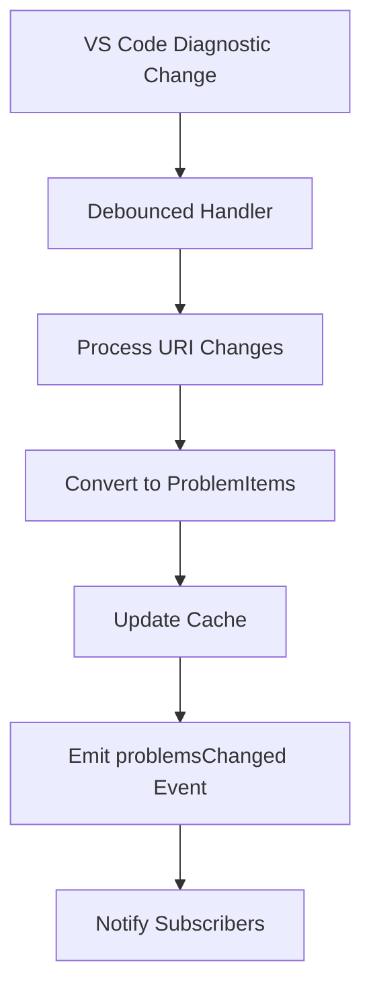
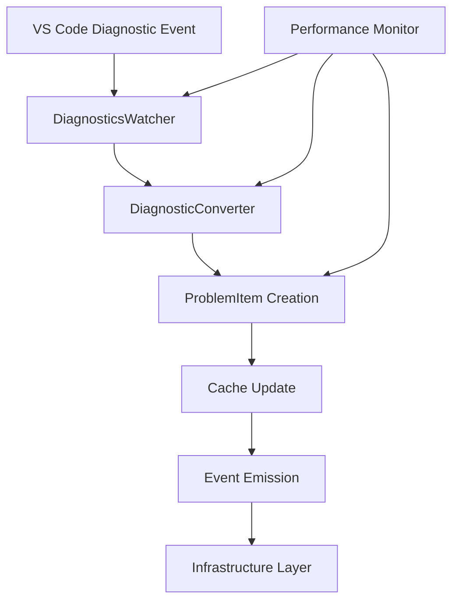

# Core Business Logic 🧠

This directory contains the **framework-independent business logic** of the MCP Diagnostics Extension. Following **Clean Architecture** principles, the core layer is isolated from external dependencies and contains the essential domain logic.

## 📋 Overview

The core layer serves as the **heart of the application**, containing:
- **Domain Models** - Pure data structures representing business entities
- **Business Services** - Core logic for diagnostic processing and monitoring
- **Use Cases** - Application-specific business rules and workflows
- **Domain Events** - Business event definitions and handling

## 🎯 Design Principles

### Framework Independence
- **No External Dependencies** - Core logic doesn't import VS Code API or MCP SDK
- **Pure TypeScript** - Only standard library and domain-specific dependencies
- **Testable in Isolation** - Can be tested without mocking external frameworks

### Domain-Driven Design
- **Ubiquitous Language** - Consistent terminology throughout the domain
- **Rich Domain Models** - Behavior and data encapsulated together
- **Domain Events** - Express business events that domain experts care about

### Single Responsibility
- **Focused Components** - Each class has one clear business purpose
- **Separation of Concerns** - Data, behavior, and coordination are separated
- **High Cohesion** - Related functionality is grouped together

## 📁 Directory Structure

```
core/
├── diagnostics/              # Diagnostic monitoring and processing
│   ├── DiagnosticsWatcher.ts    # Main diagnostic event processor
│   └── DiagnosticConverter.ts   # VS Code diagnostic → ProblemItem conversion
├── models/                   # Domain entities and value objects
│   └── ProblemItem.ts           # Core diagnostic problem representation
└── services/                 # Business logic services
    └── PerformanceMonitor.ts    # Performance tracking and metrics
```

## 🎯 Core Components

### Diagnostics Module
**Purpose**: Handle diagnostic data processing and event management

#### DiagnosticsWatcher.ts
**Primary responsibility**: Monitor and process diagnostic changes from VS Code

##### Key Features
- **Event-Driven Architecture** - Extends EventEmitter for loose coupling
- **Debounced Processing** - Prevents performance issues with rapid changes
- **Memory Management** - Efficient caching with automatic cleanup
- **Error Resilience** - Graceful handling of processing errors

##### Public Interface
```typescript
class DiagnosticsWatcher extends EventEmitter {
  constructor(vscodeApi: VsCodeApiAdapter, debounceMs?: number)
  getAllProblems(): ProblemItem[]
  getProblemsForFile(filePath: string): ProblemItem[]
  getProblemsForWorkspace(workspaceName: string): ProblemItem[]
  dispose(): void

  // Events
  on(event: 'problemsChanged', listener: (data: ProblemsChangedEvent) => void): this
  on(event: 'processingError', listener: (error: Error) => void): this
}
```

##### Event Flow


#### DiagnosticConverter.ts
**Primary responsibility**: Convert VS Code diagnostics to domain models

##### Key Features
- **Type-Safe Conversion** - Strict TypeScript conversion with validation
- **Workspace Resolution** - Determines workspace context for each diagnostic
- **Severity Mapping** - Maps VS Code severity to domain severity types
- **Error Handling** - Graceful handling of malformed diagnostic data

##### Public Interface
```typescript
class DiagnosticConverter {
  static convertToProblemItem(
    diagnostic: vscode.Diagnostic,
    uri: vscode.Uri,
    workspaceFolder?: string
  ): ProblemItem

  static convertSeverity(severity: vscode.DiagnosticSeverity): ProblemSeverity
  static validateProblemItem(item: unknown): item is ProblemItem
}
```

### Models Module
**Purpose**: Define core domain entities and value objects

#### ProblemItem.ts
**Primary responsibility**: Canonical representation of a diagnostic problem

##### Domain Model
```typescript
interface ProblemItem {
  readonly filePath: string;        // Absolute file path
  readonly workspaceFolder: string; // Workspace identifier
  readonly range: Range;            // Position information
  readonly severity: ProblemSeverity; // Error, Warning, Information, Hint
  readonly message: string;         // Human-readable description
  readonly source: string;          // Diagnostic source (ESLint, TypeScript, etc.)
  readonly code?: string | number;  // Optional error/rule code
  readonly timestamp: string;       // When the problem was detected
}

interface Range {
  readonly start: Position;
  readonly end: Position;
}

interface Position {
  readonly line: number;      // 0-based line number
  readonly character: number; // 0-based character offset
}
```

##### Business Rules
- **Immutability** - All properties are readonly after creation
- **Validation** - Strict validation of all input data
- **Serialization** - JSON-serializable for MCP transport
- **Comparison** - Equality based on file path, range, and message

### Services Module
**Purpose**: Business logic services and cross-cutting concerns

#### PerformanceMonitor.ts
**Primary responsibility**: Track and report performance metrics

##### Key Features
- **Operation Timing** - Measure execution time of critical operations
- **Memory Tracking** - Monitor memory usage patterns
- **Threshold Monitoring** - Alert when performance degrades
- **Metrics Collection** - Aggregate performance data for analysis

##### Public Interface
```typescript
class PerformanceMonitor {
  startOperation(operationName: string): OperationTimer
  recordMetric(name: string, value: number, unit: string): void
  getMetrics(): PerformanceMetrics
  checkThresholds(): ThresholdViolation[]
  reset(): void
}

interface PerformanceMetrics {
  operations: Map<string, OperationStats>;
  memory: MemoryStats;
  thresholds: ThresholdStatus[];
}
```

## 🔄 Data Flow Architecture

### Diagnostic Processing Flow


### Event-Driven Communication
```typescript
// Core emits domain events
diagnosticsWatcher.on('problemsChanged', (event) => {
  // Infrastructure layer handles the event
  mcpServer.notifyClients(event);
  statusBar.updateCounts(event.problems);
});

diagnosticsWatcher.on('processingError', (error) => {
  // Error handling and logging
  logger.error('Diagnostic processing failed', error);
});
```

## 🧪 Testing Strategy

### Unit Testing Focus
- **Pure Logic Testing** - No external dependencies to mock
- **Domain Rule Validation** - Verify business rules are enforced
- **Event Behavior** - Test event emission and handling
- **Error Scenarios** - Comprehensive error handling coverage

### Test Structure
```typescript
describe('DiagnosticsWatcher', () => {
  describe('Diagnostic Processing', () => {
    it('should convert VS Code diagnostics to ProblemItems', () => {
      // Test pure conversion logic
    });

    it('should debounce rapid diagnostic changes', async () => {
      // Test timing behavior
    });

    it('should emit problemsChanged events', () => {
      // Test event emission
    });
  });

  describe('Error Handling', () => {
    it('should handle malformed diagnostic data gracefully', () => {
      // Test error resilience
    });
  });
});
```

### Performance Testing
```typescript
describe('Performance', () => {
  it('should process 1000 diagnostics within 500ms', async () => {
    const startTime = performance.now();
    await watcher.processDiagnostics(largeDiagnosticSet);
    const duration = performance.now() - startTime;
    expect(duration).toBeLessThan(500);
  });
});
```

## 📈 Performance Considerations

### Optimization Strategies
- **Debounced Processing** - Prevent excessive processing during rapid changes
- **Efficient Caching** - Map-based storage for O(1) lookups
- **Lazy Evaluation** - Compute expensive operations only when needed
- **Memory Management** - Automatic cleanup of stale data

### Performance Metrics
- **Diagnostic Processing**: <500ms for 1000 diagnostics
- **Memory Usage**: <50MB baseline, <100MB with large datasets
- **Event Emission**: <10ms for problemsChanged events
- **Cache Operations**: <1ms for get/set operations

## 🔧 Integration Points

### Inbound Dependencies (Adapters)
- **VsCodeApiAdapter** - Provides VS Code API access through interface
- **Configuration** - Extension settings and preferences

### Outbound Events
- **problemsChanged** - Emitted when diagnostic data changes
- **processingError** - Emitted when processing fails
- **performanceAlert** - Emitted when thresholds are exceeded

### Data Contracts
```typescript
// Events emitted by core layer
interface ProblemsChangedEvent {
  readonly uri: string;
  readonly problems: ProblemItem[];
  readonly changeType: 'added' | 'updated' | 'removed';
  readonly timestamp: string;
}

interface ProcessingErrorEvent {
  readonly error: Error;
  readonly context: string;
  readonly timestamp: string;
}
```

## 🎯 Usage Examples

### Basic Diagnostic Monitoring
```typescript
// Initialize with VS Code adapter
const watcher = new DiagnosticsWatcher(vscodeAdapter);

// Listen for changes
watcher.on('problemsChanged', (event) => {
  console.log(`Problems changed in ${event.uri}:`, event.problems.length);
});

// Get current problems
const allProblems = watcher.getAllProblems();
const fileProblems = watcher.getProblemsForFile('/path/to/file.ts');
```

### Performance Monitoring
```typescript
// Track operation performance
const timer = performanceMonitor.startOperation('diagnostic-processing');
await processDiagnostics();
timer.end();

// Check for threshold violations
const violations = performanceMonitor.checkThresholds();
if (violations.length > 0) {
  console.warn('Performance thresholds exceeded:', violations);
}
```

## 🔍 Troubleshooting

### Common Issues
- **Memory Leaks** - Ensure proper disposal of event listeners
- **Performance Degradation** - Check debounce timing and cache size
- **Event Handling** - Verify event listeners are properly registered

### Debug Strategies
- **Performance Monitoring** - Use PerformanceMonitor to identify bottlenecks
- **Event Tracing** - Log event emissions and handling
- **Memory Profiling** - Monitor cache size and cleanup

---

*The core layer provides a solid foundation of business logic that is testable, maintainable, and independent of external frameworks.*
