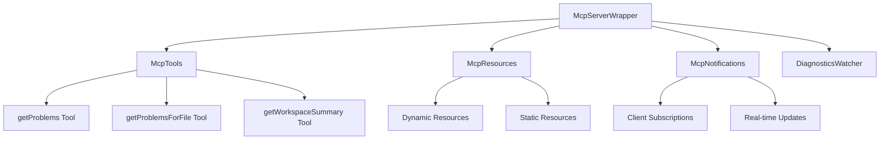
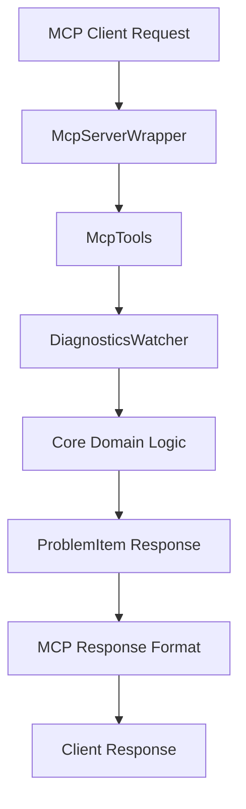
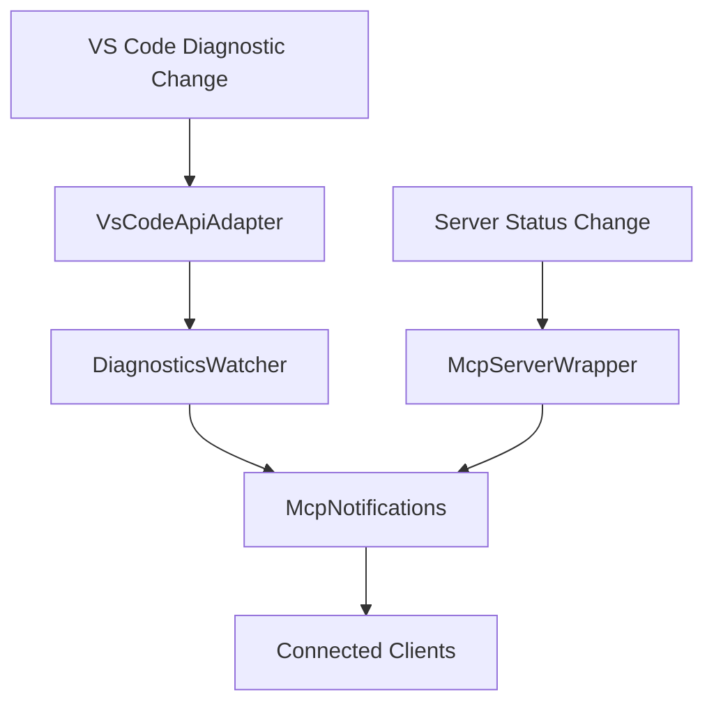

# Infrastructure Layer 🔌

This directory contains **external system adapters** that connect the core business logic to external frameworks and APIs. Following **Clean Architecture** principles, the infrastructure layer handles all external dependencies and translates between external systems and our domain models.

## 📋 Overview

The infrastructure layer serves as the **boundary between our application and the external world**, providing:
- **API Adapters** - Wrappers around external APIs (VS Code, MCP)
- **Protocol Implementations** - MCP server and client implementations
- **Data Translation** - Convert between external formats and domain models
- **External Integration** - Handle communication with external systems

## 🎯 Design Principles

### Dependency Inversion
- **Implements Core Interfaces** - Infrastructure depends on core abstractions
- **Framework Isolation** - External dependencies are contained in this layer
- **Testable Boundaries** - Clear interfaces for mocking external systems

### Adapter Pattern
- **External API Wrapping** - Wrap complex external APIs with simple interfaces
- **Data Translation** - Convert between external and internal data formats
- **Error Handling** - Translate external errors to domain errors

### Configuration Management
- **Environment Awareness** - Handle different deployment environments
- **Settings Integration** - Bridge VS Code settings with domain configuration
- **Resource Management** - Manage external resources and connections

## 📁 Directory Structure

```
infrastructure/
├── mcp/                      # Model Context Protocol implementation
│   ├── McpServerWrapper.ts      # Main MCP server coordinator
│   ├── McpTools.ts              # MCP tool implementations
│   ├── McpResources.ts          # MCP resource providers
│   └── McpNotifications.ts      # Real-time notification system
└── vscode/                   # VS Code API adapters
    └── VsCodeApiAdapter.ts      # VS Code API wrapper for testability
```

## 🎯 Core Components

### MCP (Model Context Protocol) Module
**Purpose**: Implement MCP server functionality to expose diagnostics to AI agents

#### McpServerWrapper.ts
**Primary responsibility**: Coordinate MCP server lifecycle and component integration

##### Key Features
- **Server Lifecycle Management** - Start, stop, restart MCP server
- **Component Integration** - Coordinate tools, resources, and notifications
- **Error Recovery** - Handle server failures and automatic restart
- **Configuration Management** - Apply settings and handle configuration changes

##### Public Interface
```typescript
class McpServerWrapper {
  constructor(diagnosticsWatcher: DiagnosticsWatcher, config: McpConfig)
  async start(): Promise<void>
  async restart(): Promise<void>
  isServerStarted(): boolean
  getServerInfo(): McpServerInfo
  dispose(): void

  // Events
  on(event: 'serverStarted', listener: () => void): this
  on(event: 'serverStopped', listener: () => void): this
  on(event: 'serverError', listener: (error: Error) => void): this
}
```

##### Integration Architecture


#### McpTools.ts
**Primary responsibility**: Implement MCP tools for diagnostic data access

##### Available Tools

###### getProblems
**Purpose**: Retrieve all diagnostic problems with optional filtering
```typescript
interface GetProblemsArgs {
  filePath?: string;
  severity?: ProblemSeverity;
  workspaceFolder?: string;
  limit?: number;
  offset?: number;
}

interface GetProblemsResponse {
  problems: ProblemItem[];
  total: number;
  hasMore: boolean;
  timestamp: string;
}
```

###### getProblemsForFile
**Purpose**: Get all problems for a specific file
```typescript
interface GetProblemsForFileArgs {
  filePath: string;
}

interface GetProblemsForFileResponse {
  filePath: string;
  problems: ProblemItem[];
  workspaceFolder: string;
  lastModified: string;
}
```

###### getWorkspaceSummary
**Purpose**: Get aggregated statistics across workspace
```typescript
interface GetWorkspaceSummaryResponse {
  totalProblems: number;
  problemsBySeverity: Record<ProblemSeverity, number>;
  problemsBySource: Record<string, number>;
  problemsByWorkspace: Record<string, number>;
  topProblematicFiles: Array<{
    filePath: string;
    problemCount: number;
  }>;
}
```

#### McpResources.ts
**Primary responsibility**: Expose dynamic resources for diagnostic data

##### Resource Types

###### Static Resources
- **`diagnostics://summary`** - Overall workspace diagnostics summary
- **`diagnostics://config`** - Current extension configuration
- **`diagnostics://performance`** - Performance metrics and statistics

###### Dynamic Resources
- **`diagnostics://file/{encodedFilePath}`** - Problems for specific file
- **`diagnostics://workspace/{encodedWorkspaceName}`** - Problems for workspace
- **`diagnostics://severity/{severityLevel}`** - Problems by severity level

##### Resource Implementation
```typescript
class McpResources {
  async getResource(uri: string): Promise<ResourceContent>
  listResources(): Promise<ResourceTemplate[]>
  subscribeToChanges(uri: string, callback: ResourceChangeCallback): void
  unsubscribeFromChanges(uri: string): void
}
```

#### McpNotifications.ts
**Primary responsibility**: Send real-time updates to connected MCP clients

##### Notification Types

###### problemsChanged
**Purpose**: Notify clients when diagnostic problems change
```typescript
interface ProblemsChangedNotification {
  method: 'notifications/message';
  params: {
    level: 'info';
    data: {
      type: 'problemsChanged';
      uri: string;
      problems: ProblemItem[];
      changeType: 'added' | 'updated' | 'removed';
      timestamp: string;
    };
  };
}
```

###### serverStatus
**Purpose**: Notify clients of server status changes
```typescript
interface ServerStatusNotification {
  method: 'notifications/message';
  params: {
    level: 'info';
    data: {
      type: 'serverStatus';
      status: 'started' | 'stopped' | 'error';
      timestamp: string;
    };
  };
}
```

##### Client Management
```typescript
class McpNotifications {
  addClient(clientId: string): void
  removeClient(clientId: string): void
  notifyClients(notification: McpNotification): void
  notifyClient(clientId: string, notification: McpNotification): void
  getConnectedClients(): string[]
}
```

### VS Code Module
**Purpose**: Provide testable wrappers around VS Code API

#### VsCodeApiAdapter.ts
**Primary responsibility**: Wrap VS Code API for dependency injection and testing

##### Key Features
- **API Abstraction** - Clean interface over VS Code API complexity
- **Testability** - Enable mocking of VS Code functionality
- **Error Handling** - Graceful handling of VS Code API errors
- **Type Safety** - Strict TypeScript interfaces for all operations

##### Public Interface
```typescript
interface VsCodeApiAdapter {
  // Diagnostic operations
  onDidChangeDiagnostics(listener: DiagnosticChangeListener): Disposable
  getDiagnostics(uri?: Uri): Diagnostic[]

  // Workspace operations
  getWorkspaceFolder(uri: Uri): WorkspaceFolder | undefined
  getConfiguration(section?: string): WorkspaceConfiguration

  // UI operations
  showInformationMessage(message: string): Promise<void>
  showErrorMessage(message: string): Promise<void>
  createOutputChannel(name: string): OutputChannel
}
```

##### Implementation Strategy
```typescript
class VsCodeApiAdapter implements VsCodeApiAdapter {
  constructor(private vscode: typeof import('vscode')) {}

  onDidChangeDiagnostics(listener: DiagnosticChangeListener): Disposable {
    return this.vscode.languages.onDidChangeDiagnostics(listener);
  }

  getDiagnostics(uri?: Uri): Diagnostic[] {
    return uri
      ? this.vscode.languages.getDiagnostics(uri)
      : this.vscode.languages.getDiagnostics();
  }

  // ... other methods
}
```

## 🔄 Data Flow Architecture

### MCP Request Flow


### Notification Flow


## 🧪 Testing Strategy

### Integration Testing Focus
- **External API Mocking** - Mock VS Code and MCP SDK APIs
- **Protocol Compliance** - Verify MCP protocol adherence
- **Error Scenarios** - Test external system failures
- **Performance Testing** - Validate response times and throughput

### Test Structure
```typescript
describe('McpServerWrapper', () => {
  describe('Server Lifecycle', () => {
    it('should start server successfully', async () => {
      await mcpServer.start();
      expect(mcpServer.isServerStarted()).toBe(true);
    });

    it('should handle startup failures gracefully', async () => {
      mockMcpSdk.createServer.mockRejectedValue(new Error('Port in use'));
      await expect(mcpServer.start()).rejects.toThrow('Port in use');
    });
  });

  describe('Tool Integration', () => {
    it('should register all tools on startup', async () => {
      await mcpServer.start();
      expect(mockMcpSdk.registerTool).toHaveBeenCalledTimes(3);
    });
  });
});
```

### Mock Strategies
```typescript
// VS Code API mocking
const mockVsCodeApi: jest.Mocked<VsCodeApiAdapter> = {
  onDidChangeDiagnostics: jest.fn(),
  getDiagnostics: jest.fn().mockReturnValue([]),
  getWorkspaceFolder: jest.fn(),
  // ... other methods
};

// MCP SDK mocking
jest.mock('@modelcontextprotocol/sdk', () => ({
  McpServer: jest.fn().mockImplementation(() => ({
    start: jest.fn(),
    stop: jest.fn(),
    registerTool: jest.fn(),
  })),
}));
```

## 📈 Performance Considerations

### Optimization Strategies
- **Connection Pooling** - Reuse MCP connections when possible
- **Response Caching** - Cache expensive operations (workspace summaries)
- **Batch Notifications** - Group related notifications to reduce overhead
- **Lazy Loading** - Load resources only when requested

### Performance Metrics
- **MCP Tool Response**: <100ms for simple queries
- **Resource Loading**: <200ms for dynamic resources
- **Notification Delivery**: <50ms to all connected clients
- **Server Startup**: <2 seconds from activation

## 🔧 Configuration Management

### Extension Settings Integration
```typescript
interface McpConfig {
  server: {
    port: number;
    enabled: boolean;
    maxClients: number;
  };
  tools: {
    enableGetProblems: boolean;
    enableGetProblemsForFile: boolean;
    enableWorkspaceSummary: boolean;
  };
  notifications: {
    enableProblemsChanged: boolean;
    enableServerStatus: boolean;
    debounceMs: number;
  };
}
```

### Environment-Specific Configuration
```typescript
// Development vs Production settings
const config = process.env.NODE_ENV === 'development'
  ? developmentConfig
  : productionConfig;
```

## 🎯 Usage Examples

### MCP Server Setup
```typescript
// Initialize MCP server with dependencies
const mcpServer = new McpServerWrapper(diagnosticsWatcher, config);

// Start server and handle events
await mcpServer.start();

mcpServer.on('serverStarted', () => {
  console.log('MCP server is ready for connections');
});

mcpServer.on('serverError', (error) => {
  console.error('MCP server error:', error);
  // Implement retry logic
});
```

### VS Code API Integration
```typescript
// Create adapter for testability
const vscodeAdapter = new VsCodeApiAdapter(vscode);

// Use adapter in core logic
const diagnosticsWatcher = new DiagnosticsWatcher(vscodeAdapter);

// Mock in tests
const mockAdapter = createMockVsCodeAdapter();
const testWatcher = new DiagnosticsWatcher(mockAdapter);
```

## 🔍 Troubleshooting

### Common Issues
- **MCP Server Startup Failures** - Check port availability and permissions
- **Client Connection Issues** - Verify MCP protocol compatibility
- **Performance Degradation** - Monitor notification frequency and payload size
- **VS Code API Errors** - Handle API changes and version compatibility

### Debug Strategies
- **MCP Protocol Logging** - Enable detailed MCP communication logs
- **Performance Monitoring** - Track response times and resource usage
- **Error Aggregation** - Collect and analyze error patterns
- **Client Debugging** - Provide debugging tools for MCP clients

### Monitoring and Observability
```typescript
// Performance monitoring
const performanceMonitor = new PerformanceMonitor();
performanceMonitor.trackOperation('mcp-tool-call', async () => {
  return await mcpTools.getProblems(args);
});

// Error tracking
const errorTracker = new ErrorTracker();
errorTracker.captureException(error, {
  context: 'mcp-server',
  operation: 'tool-call',
  args: sanitizedArgs,
});
```

---

*The infrastructure layer provides reliable, performant bridges between our core business logic and external systems, ensuring clean separation of concerns and testability.*
